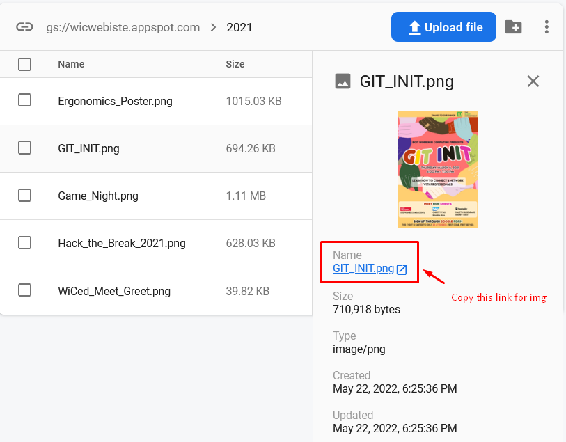

Hello!

This website is created using React. If you've taken the Intro to Web Dev course or have experience with basic HTML, CSS, and JS you should be good.

# Before you start

1. Have nodejs instaled [https://nodejs.org/en/]
2. Create a branch for yourself
3. View the TODO file to see what else needs to done.
4. Inform the group chat (WhatsApp/Discord) if you will be working on a section
5. Message the WhastsApp or the Discrod chat if you have any questions

## Data Strucure

Note: Ignore the other files not mentioned. Also not sure about how I did the file structure. This is my first time working with React so I'm not sure what the conventions of folder structure.

    public:
        - main index.html file

    src:
        - components:
          - Contains folders of based on page or reusable components. Each folder contains Typescript Files for each section (Navbar, About Us, Events, etc.) and CSS file.

        - App.tsx:
            - Main TS where all the TS are called to be rendered

        - index.tsx:
            - Redenders App.tsx

# Updating Firebase

1. Login to [Firebase](https://console.firebase.google.com/u/2/project/wicwebiste/firestore/data/~2Fevents~2FMB3A1VS3flmJS7pts3kJ) using the WiC gmail account.
2. Add Event poster image to [Firebase Storage](https://console.firebase.google.com/u/2/project/wicwebiste/storage/wicwebiste.appspot.com/files). Upload image to `/<event year>` then use image link for `img` field:
   

3. Add the new events information using the following fields:

```
- title:string = <Events>
- description:string = <Event Description>
- img:string = <Image from storage link>
- isActive:boolean = <true/false>
- register:string = <Registration Link>
- date:timestamp = <Add date field, time field can be left empty>
- time:string = <Time of event>
- venue:string = <Platform using (Discord, Zoom, etc.)>
```

# Usage

## Starting React

1. `npm install` this will install the packages needed to build react
2. `npm start` this starts up the server and automatically open the page on your browser.
3. `http://localhost:3000`

## Closing React server

1. `ctrl + c`
2. `y`

## Update Live

1. Be logged in to the wic github account
2. Deploy live branch
   - `npm run deploy`

Note: The text css in Events will display differently for the deployed and testing due to <Text> usign different classnames

# TODO

Things to do for the website
_(Feel free to add more things here)_

- [x] Change from JS to Typescript
- [x] Move assets and Event Information to Firebase
- [ ] Add new events after 2021
- [ ] Make it look prettier
